# 🌱 AgriTech - Smart Agriculture Management System

<div align="center">

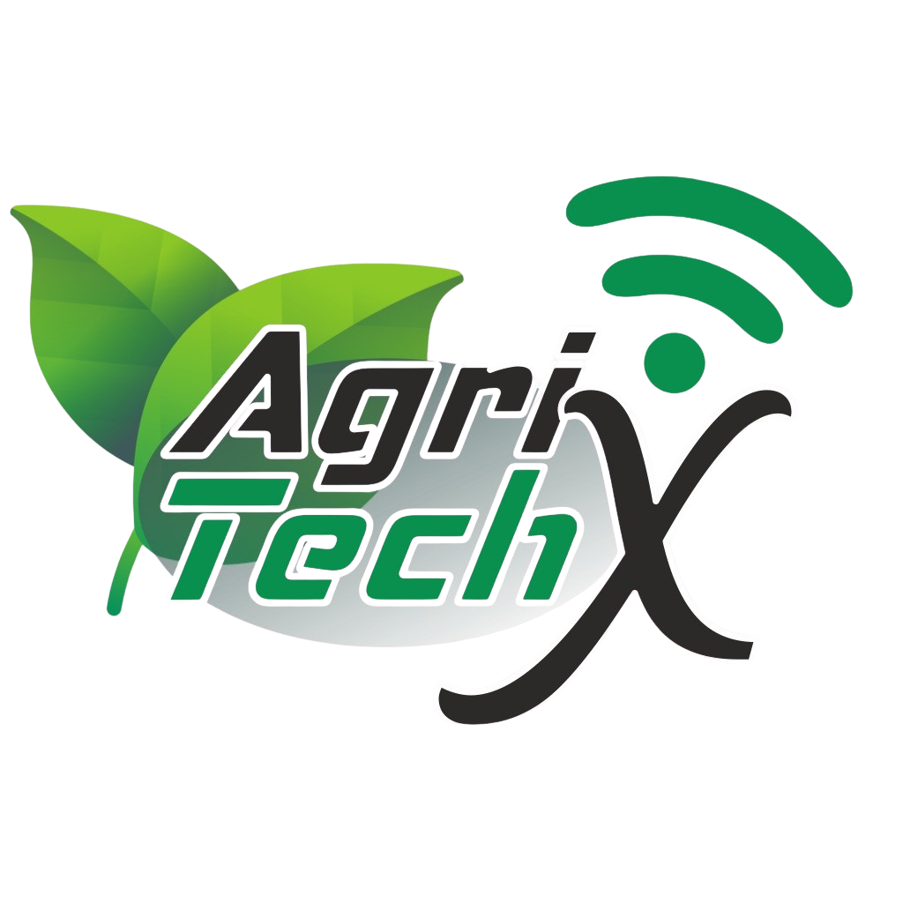

**Revolutionizing Agriculture with Smart Technology**

[](https://flutter.dev/)
[](https://dart.dev/)
[](LICENSE)
[](https://flutter.dev/)

</div>

---

## 📋 Table of Contents

- [Overview](#-overview)
- [Features](#-features)
- [Screenshots](#-screenshots)
- [Architecture](#-architecture)
- [Getting Started](#-getting-started)
- [Installation](#-installation)
- [Usage](#-usage)
- [API Integration](#-api-integration)
- [Project Structure](#-project-structure)
- [Technologies Used](#-technologies-used)
- [Contributing](#-contributing)
- [License](#-license)

---

## 🌟 Overview

AgriTech is a comprehensive smart agriculture management system built with Flutter that enables farmers to monitor and control their hydroponic farming systems remotely. The application provides real-time monitoring of environmental conditions, automated control systems, and AI-powered plant analysis.

### Key Capabilities

- **Real-time Sensor Monitoring**: Track temperature, humidity, pH, EC/TDS levels
- **Automated Control Systems**: Manage lighting, water pumps, and nutrient dosing
- **AI-Powered Analysis**: Plant disease detection and health monitoring
- **Smart Dashboard**: Comprehensive farm management interface
- **Remote Access**: Control your farm from anywhere

---

## ✨ Features

### 🏠 **Home Dashboard**
- Real-time sensor data visualization
- Environmental monitoring (temperature, humidity)
- Historical data charts and analytics
- Quick status overview

### 🌿 **Farm Management**
- **Light Control System**
  - Automated lighting schedules
  - White and growth light management
  - AI-controlled optimization
  - Manual override capabilities

- **Water Pump Control**
  - Automated irrigation scheduling
  - Duration and frequency control
  - Real-time pump status monitoring
  - Emergency shutdown capabilities

- **pH Control System**
  - Automated pH monitoring and adjustment
  - Precise dosing control
  - Historical pH tracking
  - Alert system for pH fluctuations

- **TDS/EC Control**
  - Nutrient concentration monitoring
  - Automated nutrient dosing
  - EC/TDS level optimization
  - Real-time conductivity tracking

### 🤖 **AI-Powered Features**
- **Plant Disease Detection**
  - Camera-based plant analysis
  - Early disease identification
  - Treatment recommendations
  - Health monitoring

- **Smart Analysis**
  - AI-driven insights
  - Predictive analytics
  - Growth optimization suggestions
  - Yield prediction

### 💬 **AI Chat Assistant**
- Intelligent farming advice
- Troubleshooting support
- Best practices recommendations
- 24/7 expert assistance

### 👤 **User Management**
- Secure authentication system
- User profiles and preferences
- Role-based access control
- Multi-user farm management

---

## 📱 Screenshots

<div align="center">

### Main Dashboard
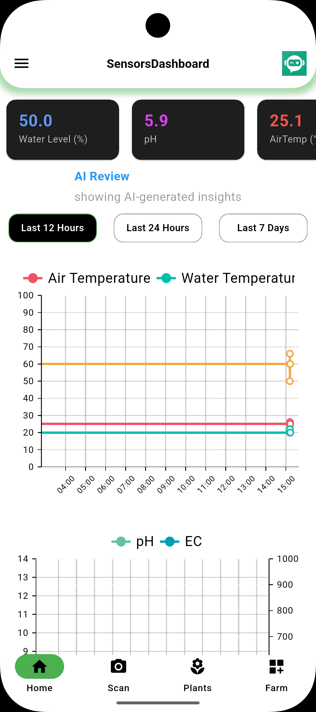
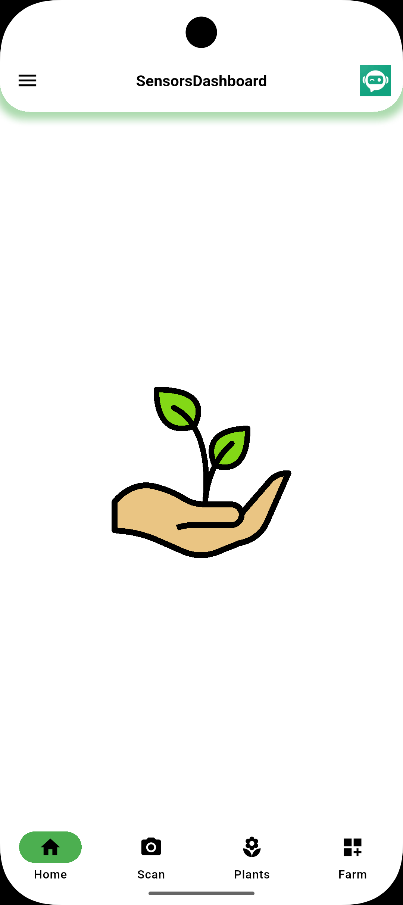
### Farm Control Interface
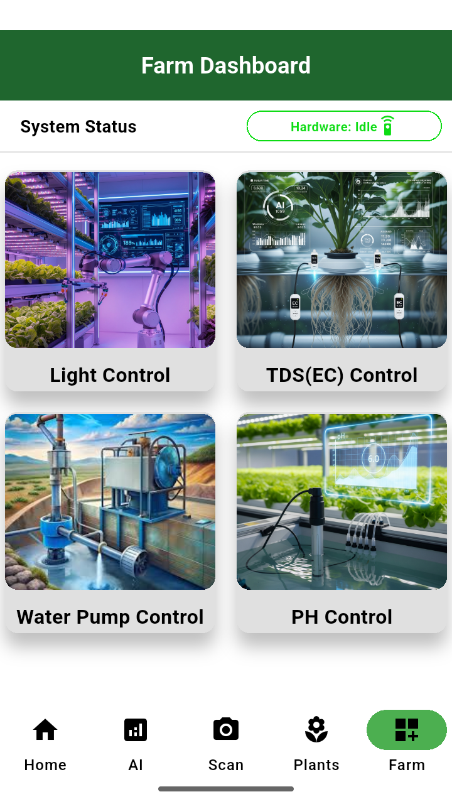

### Sensor Monitoring
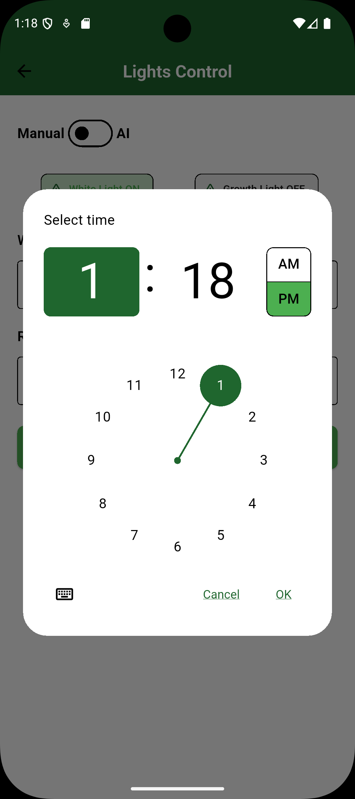

### AI Analysis
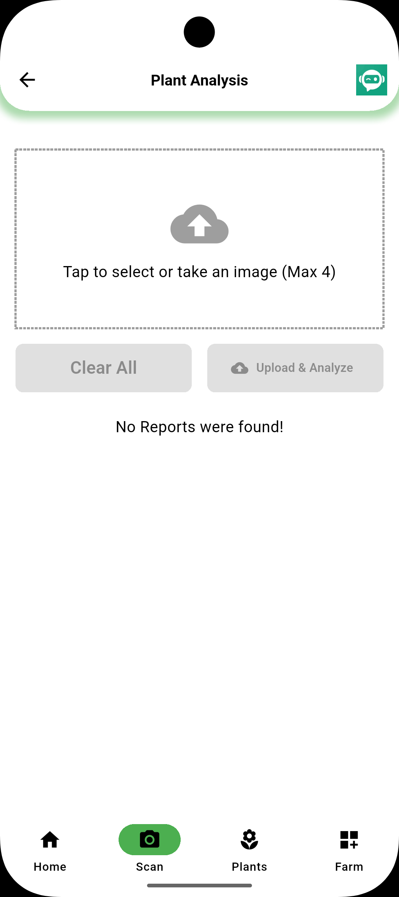
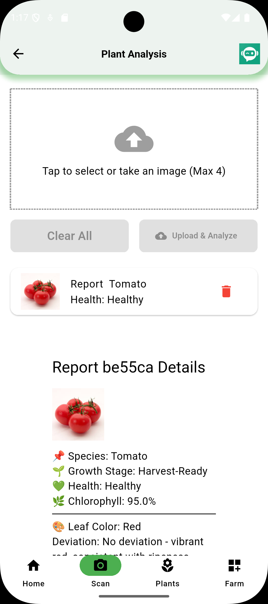
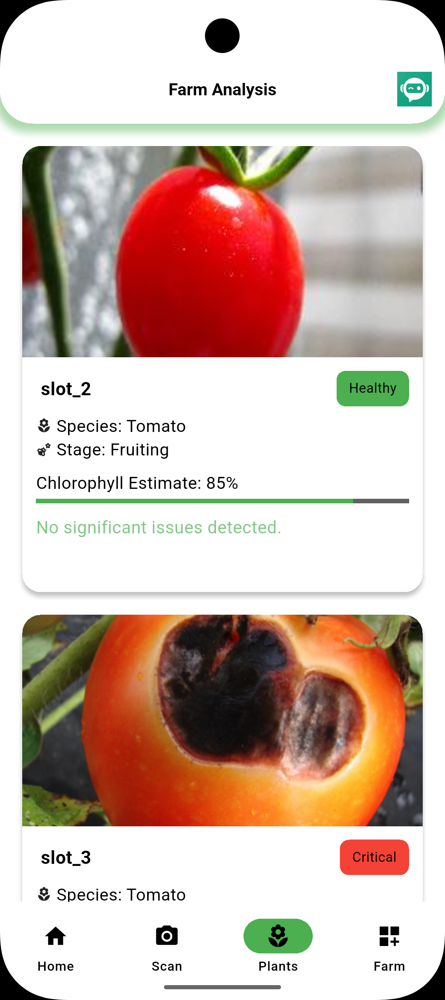
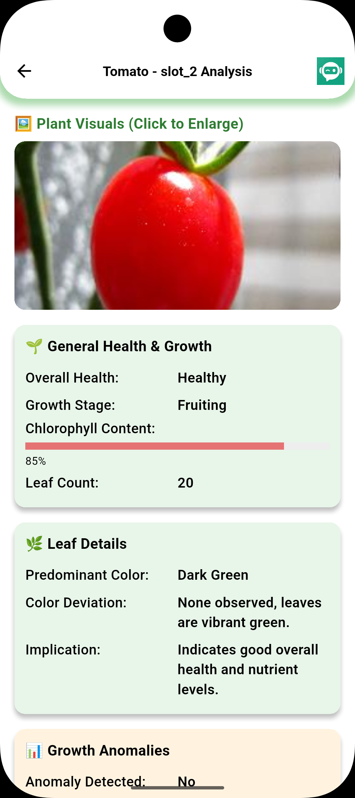
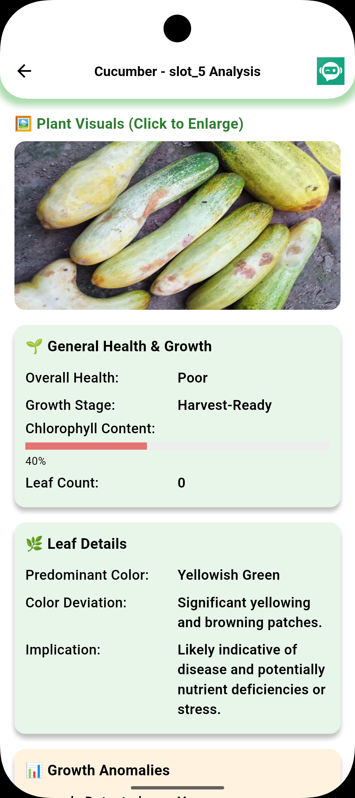
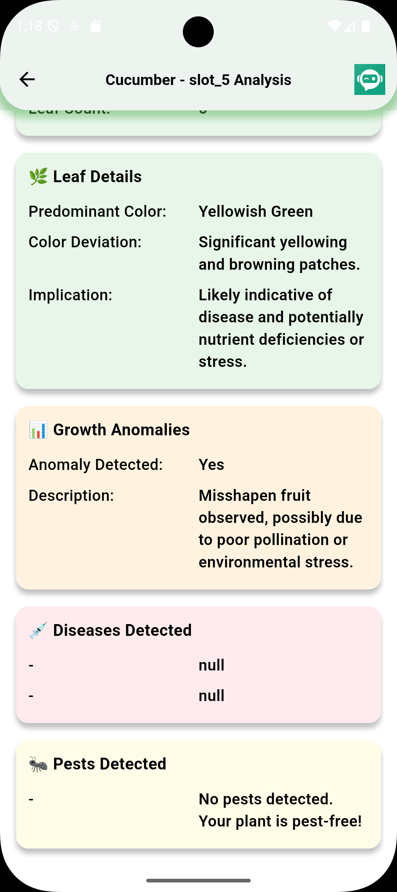
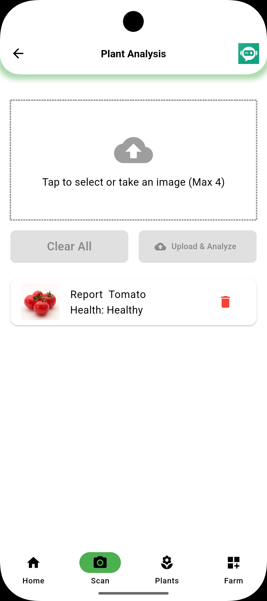
### Light Control
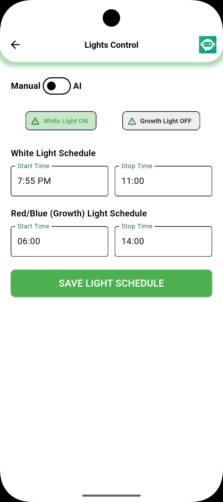

### Water Pump Management


### pH Control System
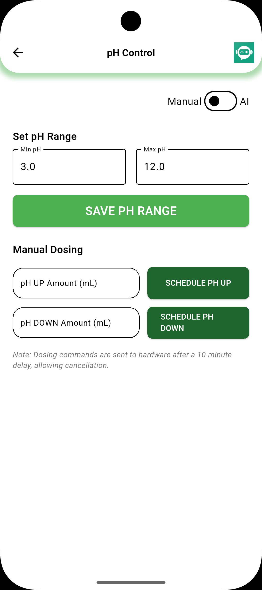

### TDS/EC Monitoring
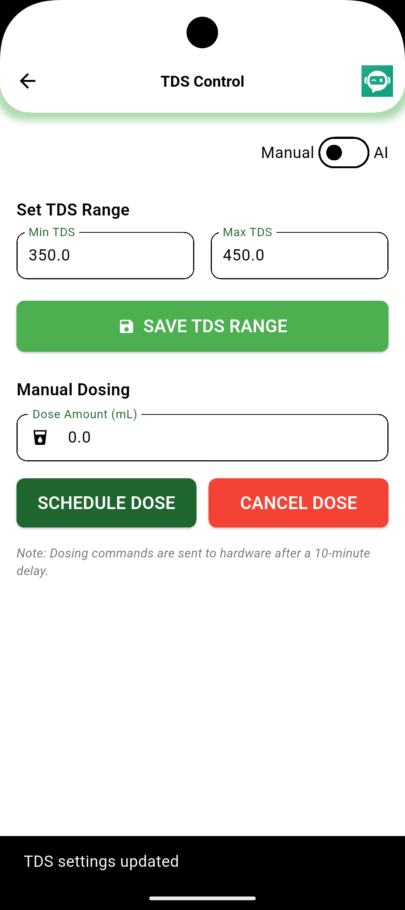
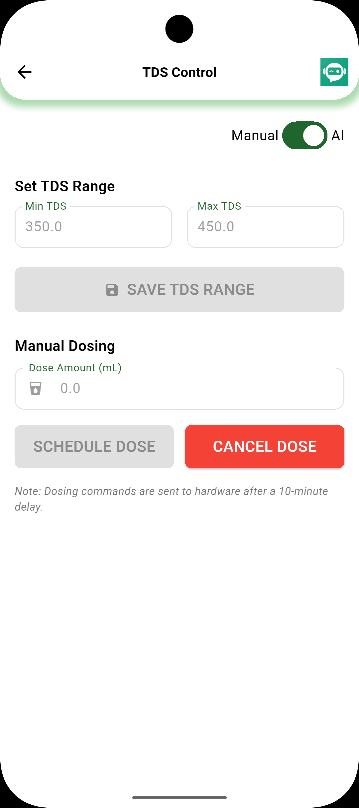
### login 


###  splash 
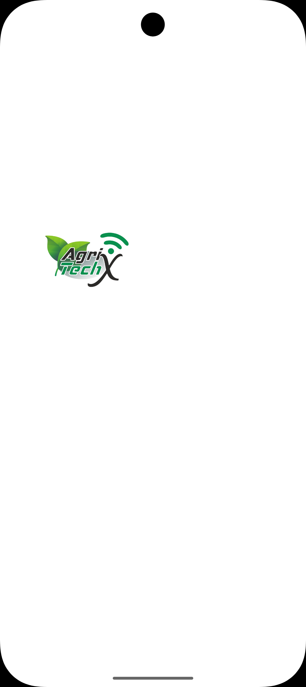


</div>

---

## 🏗️ Architecture

AgriTech follows **Clean Architecture** principles with a feature-based modular structure:

```
lib/
├── core/                    # Shared utilities and configurations
│   ├── constants/          # App-wide constants
│   ├── network/            # API client and interceptors
│   ├── utils/              # Helper functions and DI
│   └── widgets/            # Reusable UI components
├── features/               # Feature modules
│   ├── auth/              # Authentication system
│   ├── home/              # Main dashboard
│   ├── farmdashboard/     # Farm management
│   ├── plant_analysis/    # Plant health monitoring
│   ├── ai_scan_analysis/  # AI-powered analysis
│   ├── chat_bot/          # AI assistant
│   └── profile/           # User management
├── shared/                # Shared models and services
└── app/                   # App configuration
```

### Architecture Layers

- **Presentation Layer**: UI components, controllers, and state management
- **Domain Layer**: Business logic, entities, and use cases
- **Data Layer**: Repository implementations and data sources

---

## 🚀 Getting Started

### Prerequisites

- Flutter SDK (3.7.0 or higher)
- Dart SDK (3.0 or higher)
- Android Studio / VS Code
- Git

### System Requirements

- **Android**: API level 21+ (Android 5.0+)
- **iOS**: iOS 12.0+
- **Web**: Modern browsers with WebGL support

---

## 📦 Installation

1. **Clone the repository**
   ```bash
   git clone https://github.com/Ahmed-Abdel-Majeed/Graduation-project_AgriTech
   cd agritech
   ```

2. **Install dependencies**
   ```bash
   flutter pub get
   ```

3. **Configure environment**
   ```bash
   # Copy environment template
   cp .env.example .env
   
   # Update with your API keys and configurations
   nano .env
   ```

4. **Run the application**
   ```bash
   flutter run
   ```

### Build for Production

```bash
# Android APK
flutter build apk --release

# iOS
flutter build ios --release

# Web
flutter build web --release
```

---

## 🔧 Usage

### Initial Setup

1. **Create Account**: Register with email or Google account
2. **Farm Configuration**: Set up your farm parameters
3. **Sensor Calibration**: Calibrate pH and TDS sensors
4. **Schedule Setup**: Configure automated schedules

### Daily Operations

1. **Monitor Dashboard**: Check real-time sensor data
2. **Adjust Controls**: Modify lighting, watering, or nutrient schedules
3. **Review Analytics**: Analyze historical data and trends
4. **AI Analysis**: Use camera for plant health monitoring

### Advanced Features

- **Automated Scheduling**: Set up recurring tasks
- **Alert System**: Configure notifications for critical events
- **Data Export**: Download reports and analytics
- **Multi-Farm Management**: Manage multiple locations

---

## 🔌 API Integration

AgriTech integrates with the following APIs:

### Farm Control API
```
Base URL: https://api-testapp.netlify.app/api/farmcontrol
Methods: GET, PUT
```

**Endpoints:**
- `GET /` - Retrieve farm control data
- `PUT /` - Update farm control settings
- `PUT /lightSystem` - Update lighting configuration
- `PUT /waterPump` - Update water pump settings
- `PUT /tds` - Update TDS control parameters
- `PUT /ph` - Update pH control parameters

### Sample API Response
```json
{
  "hardwareStatus": {
    "nextExecutionTime": 1749419568,
    "state": "idle"
  },
  "lightSystem": {
    "whiteLight": {
      "stopTime": "00:00",
      "startTime": "00:00",
      "isCurrentlyOn": false
    },
    "growthLight": {
      "startTime": "05:00",
      "stopTime": "01:03",
      "isCurrentlyOn": false
    },
    "isControlledByAI": false
  },
  "waterPump": {
    "durationMinutes": 411,
    "isControlledByAI": false,
    "isCurrentlyRunning": false
  },
  "TDS": {
    "isControlledByAI": false,
    "max": 0.6,
    "min": 0.2,
    "doseAmount": 0
  },
  "pH": {
    "doseAmount": 0,
    "isControlledByAI": false,
    "max": 0,
    "min": 0
  }
}
```

---

## 📁 Project Structure

```
agritech/
├── lib/
│   ├── core/                    # Core utilities
│   │   ├── constants/           # App constants
│   │   ├── network/             # API client
│   │   ├── utils/               # Utilities and DI
│   │   └── widgets/             # Shared widgets
│   ├── features/                # Feature modules
│   │   ├── auth/               # Authentication
│   │   ├── home/               # Main dashboard
│   │   ├── farmdashboard/      # Farm management
│   │   ├── plant_analysis/     # Plant monitoring
│   │   ├── ai_scan_analysis/   # AI analysis
│   │   ├── chat_bot/           # AI assistant
│   │   └── profile/            # User profile
│   ├── shared/                 # Shared resources
│   └── app/                    # App configuration
├── assets/
│   ├── images/                 # App images
│   ├── icons/                  # App icons
│   └── fonts/                  # Custom fonts
├── test/                       # Unit tests
├── android/                    # Android configuration
├── ios/                        # iOS configuration
└── web/                        # Web configuration
```

---

## 🛠️ Technologies Used

### Frontend
- **Flutter** - Cross-platform UI framework
- **Dart** - Programming language
- **Flutter Bloc** - State management
- **GetIt** - Dependency injection

### Backend & APIs
- **Dio** - HTTP client
- **Retrofit** - API client generation
- **Firebase Auth** - Authentication
- **Google Generative AI** - AI features

### Data & Storage
- **Shared Preferences** - Local storage
- **JSON Serialization** - Data parsing
- **Charts** - Data visualization

### Development Tools
- **Build Runner** - Code generation
- **Mockito** - Testing
- **Logger** - Debugging

---

## 🤝 Contributing

We welcome contributions! Please follow these steps:

1. **Fork the repository**
2. **Create a feature branch**
   ```bash
   git checkout -b feature/amazing-feature
   ```
3. **Commit your changes**
   ```bash
   git commit -m 'Add amazing feature'
   ```
4. **Push to the branch**
   ```bash
   git push origin feature/amazing-feature
   ```
5. **Open a Pull Request**

### Development Guidelines

- Follow Flutter best practices
- Write unit tests for new features
- Update documentation
- Use conventional commit messages

### Code Style

- Follow Dart style guide
- Use meaningful variable names
- Add comments for complex logic
- Keep functions small and focused

---

## 📄 License

This project is licensed under the MIT License - see the [LICENSE](LICENSE) file for details.

---

## 📞 Support
- **phone**:+201501053538
- **Email**:ahmedabdalmaged2002@yahoo.com
---

## 🙏 Acknowledgments

- Flutter team for the amazing framework
- All contributors and beta testers
- The open-source community

---

<div align="center">

**Made with ❤️ for the future of agriculture**

[Website](https://github.com/Ahmed-Abdel-Majeed/Graduation-project_AgriTech#) • [Documentation](https://docs.agritech.com) • [Support](https://support.agritech.com)

</div> 